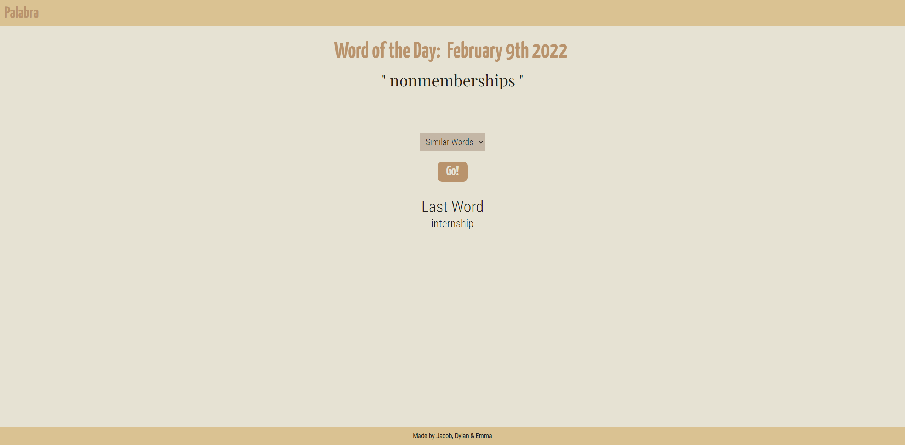
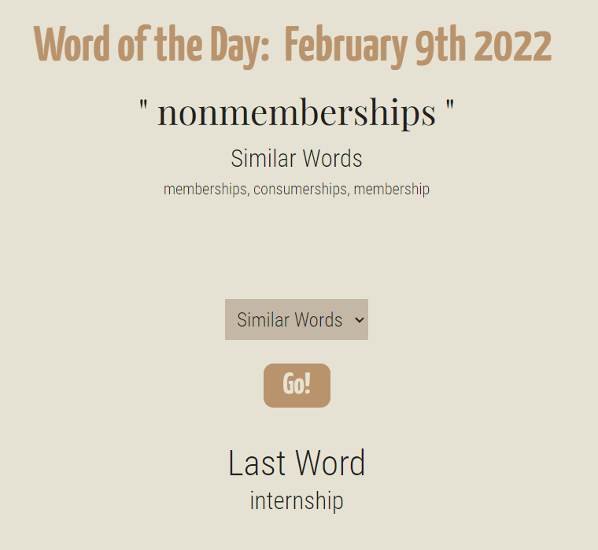
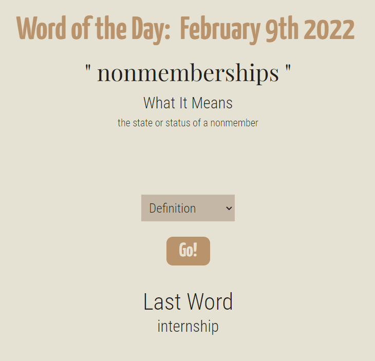
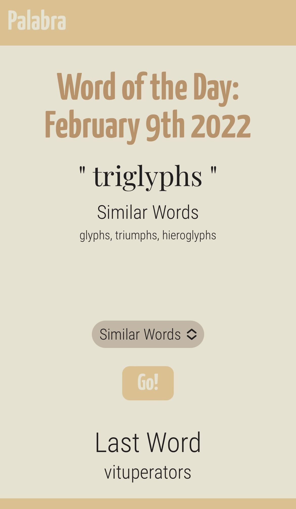
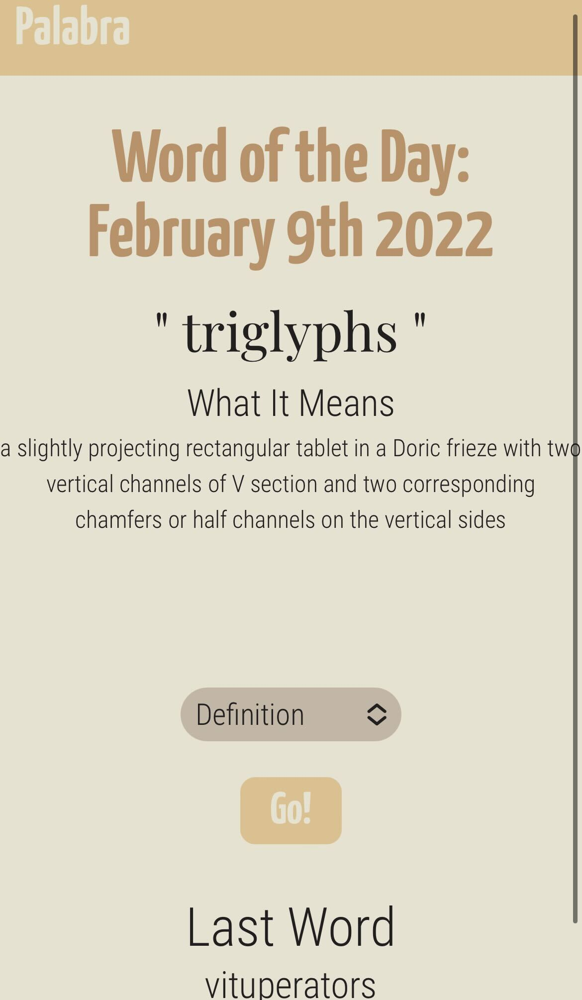

# Palabra - learn one word a day
Palabra is a word-of-the-day app. Behind its simplistic exterior, we wanted something dynamic, functional, and scalable. Palabra can be used to learn a new word each day, as well as its definition and synonyms. 

## User Story
AS A USER, I want an application that displays a new word in a chosen language every day and to have a list of previously learned words stored on the page so that I can increase my vocabulary.

## Acceptance Critera
WHEN, the page loads
THEN, I am presented with all of the words I have learned so far
GIVEN, I am presented with a page with a drop down to choose a language
WHEN, I choose a language from the drop down box and press the Go button
THEN, the application displays a word in english and the chosen language, as well as the definition
WHEN, I have generated a new word,
THEN, The words I have previously learned will display on the page

## Uses
The application can be used to expand ones vocabulary. You can learn a new word each day and choose to have that word defined or learn similar words from the drop-down menu.

## Deployed app
The deployed application can be found here: https://djmarcy.github.io/palabra/

## Collaborators
Jacob Lewis
Dylan Marcy
Emma Reimer

## References
Two API's were used:
1. Miriam Webster dictionary API
2. http://random-word-api.herokuapp.com/home

Libraries and Framework include:
1. Tailwind
2. Momentjs

Lanuges used include:
1. CSS
2. HTML
3. Javascript

## Screenshots
Here are pictures that show the functionality of the application:

